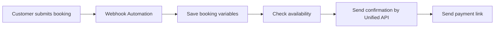

Recipes show how to combine APIs and flows for common products.

## Ecommerce order confirmation

Use Unified Messaging with fallback.

```json
{
  "to": "{{customer.phone}}",
  "text": "Hi {{customer.name}}, your order #{{order.id}} has been received.",
  "channels": ["whatsapp_qr", "whatsapp_meta", "sms"],
  "deliveryMode": "fallback",
  "whatsappFrom": "447405993704",
  "sender": "SHOP"
}
```

## Booking request

Use Automation Flow first, then Unified API when the booking is confirmed.



## Login OTP

Use Unified OTP with fallback.

```json
{
  "to": "+255700000000",
  "channels": ["whatsapp_qr", "sms"],
  "deliveryMode": "fallback",
  "length": 6,
  "expiresIn": 300,
  "template": "Your login code is {{code}}. It expires in {{minutes}} minutes."
}
```

## Urgent OTP to both WhatsApp and SMS

Use `deliveryMode: "all"`.

```json
{
  "to": "+255700000000",
  "channels": ["whatsapp_qr", "sms"],
  "deliveryMode": "all"
}
```

## Human support fallback

When an automated flow cannot solve a request:

1. Send a short handoff message.
2. Disable automation for the conversation.
3. Create an agent task.
4. Let the user continue with a human.

