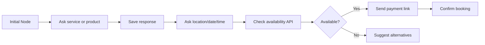

Automation Flows let you design a customer journey visually. A flow can reply to WhatsApp messages, collect information, call external APIs, save variables, route by conditions, and hand off to a human agent.

## Flow types

| Flow type | Trigger |
| --- | --- |
| WhatsApp Chatbot | Incoming WhatsApp messages |
| Webhook Automation | Incoming webhook payloads from stores, booking systems, or CRMs |
| Broadcast Flow | Campaign or scheduled message logic |
| Unified Messaging | API-triggered messages and fallback logic |

## Common nodes

| Node | Use it for |
| --- | --- |
| Send Message | Send text, media, or interactive replies |
| Condition | Route users based on message text or saved variables |
| Response Saver | Save user replies into variables |
| Make Request | Call an external API |
| Delay | Slow down the flow for a more natural conversation |
| Reset Session | Clear saved variables |
| Send Email | Notify your team by SMTP |
| Google Sheets | Save leads or bookings |
| Agent Transfer | Hand off to a human |
| AI Transfer | Let an AI assistant continue the conversation |

## Booking flow pattern



## Webhook automation pattern

Use Webhook Automation when another system already knows the customer action.

Example events:

- Ecommerce order placed.
- Booking request created.
- Payment received.
- Shipping status changed.
- Lead captured from website form.

Recommended flow:

1. Extract the phone number from the payload.
2. Send a short confirmation.
3. Add a delay when the message feels too fast.
4. Route based on payment method or order status.
5. Log success or failure.
6. Send fallback SMS if WhatsApp is not available.

## Human agent handoff

When a user asks for an agent, the flow should stop automation for that chat for a while. This prevents the bot from replying again while a human is helping.

Recommended behavior:

- Send an agent handoff message.
- Disable auto-reply for the conversation.
- Notify an agent.
- Re-enable automation only after timeout or manual reset.

## Variables

Variables let one node use data from earlier nodes.

Examples:

```text
{{{customer.name}}}
{{{customer.phone}}}
{{{order.id}}}
{{{payment_method.text}}}
```

Webhook Automation supports nested paths from JSON payloads.

## Best practices

- Use short messages.
- Add small delays between long steps.
- Validate important answers before saving them.
- Always provide a route to human support.
- Keep payment and OTP verification server-side.

