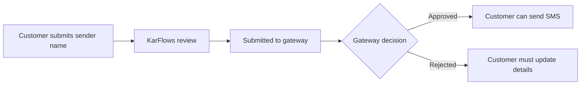

Sender names control what the customer sees as the SMS source.

KarFlows protects sender names so one customer cannot accidentally use another customer's approved sender.

## Approval flow

## Required customer information

Customers should provide:

- Sender name: 3 to 11 letters or numbers, no spaces.
- Sender name description.
- Sample message content.
- Company name.
- Company origin.
- Company URL.
- Use case.

## Network status

Sender approval can be tracked by network:

- Vodacom TZ
- Tigo TZ
- Airtel TZ
- Halotel TZ
- TTCL

## Send-time validation

Before sending SMS, KarFlows checks:

1. Sender name belongs to the API token owner.
2. Sender name is approved in KarFlows.
3. Gateway/network status is approved.
4. Customer has SMS balance.
5. Customer plan allows SMS API access.

If any check fails, KarFlows rejects the request before sending.

